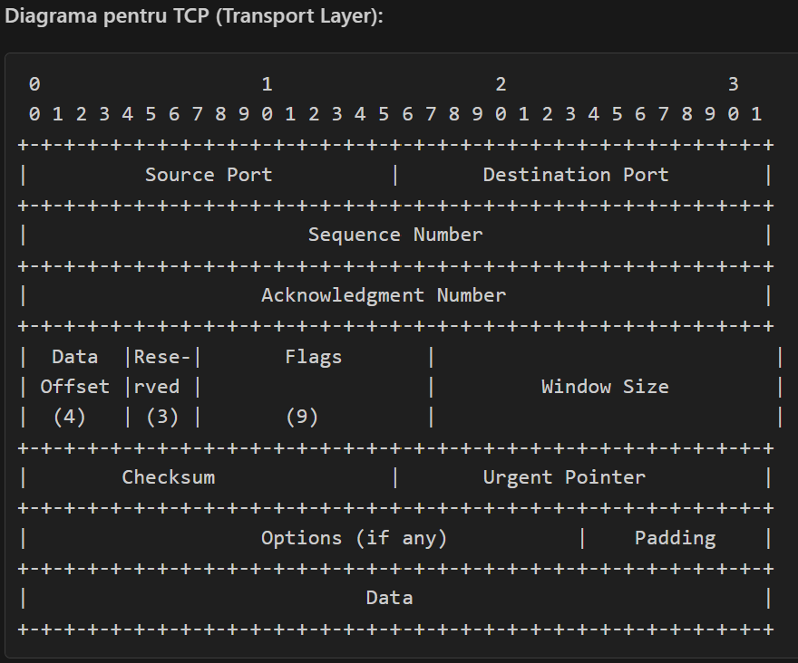
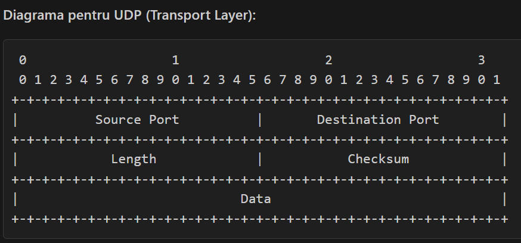
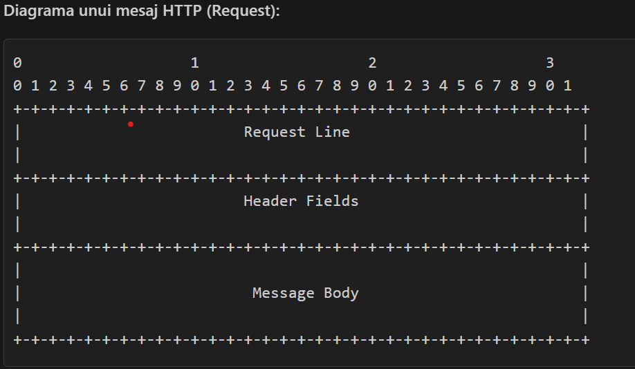

# GUI_HTTP_Sniffer-Python

## Requirements
----------------------------------------------------------------
Implementați o aplicație care implementează un sniffer de pachete HTTP. Aplicația ar
trebui să permită vizualizarea real-time a requesturilor, aplicarea de filtre pe traficul de
pachete (ex: requesturi venite de la o anumită adresă, requesturi de anumite tipuri:
GET/POST/DELETE s.a.m.d). Totodată, pentru un anume request, ar trebuie ca

userul să poată afla detalii despre requestul respectiv: headers, request mode,
payload, etc
Nu este necesar un GUI (datele se pot afișa și în consola).Trebuie sa fie totuși o
reprezentare clară a acestor date (sa se inteleaga ce anume reprezinta).
Traficul se capturează cu ajutorul bibliotecii socket iar decodarea pachetelor se va
face cu struct/ctypes

----------------------------------------------------------------
### About implementation 
----------------------------------------------------------------
Sniffest HTTP Python
Proiectul Sniffest HTTP Python este o aplicatie complexa care combina o interfata grafica de utilizator (GUI) si un serviciu de sniffer pentru a captura, parsa si analiza pachetele HTTP from scratch. Sniffer-ul capteaza pachete de pe network layer, transport layer si application layer.

Componente Principale
Interfata Grafica de Utilizator (GUI)
Serviciul de Sniffer (sniffer-service)
Interfata Grafica de Utilizator (GUI)
Interfata grafica a fost construita folosind biblioteca PyQt6. Aceasta ofera o interfata intuitiva si usor de utilizat pentru vizualizarea si analiza pachetelor capturate.

Functionalitati Cheie:
Afisarea Pachetelor: Pachetele capturate sunt afisate intr-un tabel, cu detalii despre fiecare pachet.
Filtrare: Utilizatorii pot filtra pachetele afisate pe baza diferitelor criterii, cum ar fi adresa IP sursa, adresa IP destinatie, protocol, etc.
Detalii Pachet: Utilizatorii pot vizualiza detalii suplimentare despre fiecare pachet intr-o fereastra separata, cu toate informatiile capturate, parsate, structurate pe straturi (network, transport, application).
Serviciul de Sniffer (sniffer-service)
Serviciul de sniffer este responsabil pentru capturarea pachetelor de retea si trimiterea acestora catre interfata grafica pentru vizualizare si analiza.
Capturarea Pachetelor: Se conecteaza prin socket la retea: Obtine pachetele cu STREAM_RAW. Obtine modul promiscuu initial pentru a putea avea permisiunea de la SO pentru captarea pachetelor. (Atentie: unele SO pot avea anumite restrictii in privinta capturarii pachetelor)
Se capteaza pachetele raw de pe retea ,si se returneaaza pachetul impreuna cu headerul si payload -ul.
Parsarea Pachetelor: S a folosit struct pentru formatarea ,parsarea,si interpretarea pachetelor de retea.Incepand de la network layer ,transport layer si pana la aplication layer,raw_data este formatat,parsat si adaugat la dicntionarul final,pachetul trecand prin toate aceste straturi.Sunt tratate diferite scenarii,precum ifnorarea diferitiloe octeti corupti la inceputul/sfarsitul pachetelor,fragmentarea pachetelor,reordonarea/reasamblarea acestora dupa sequence number, tratarea scenariilor folosind flaguri precum FIN si RST, in care se inchid conexiunile si alte scenarii.
Analiza Pachetelor: Pachetele capturate sunt analizate si structurate pe straturi (network, transport, application).
Trimiterea Pachetelor: Pachetele analizate sunt trimise catre interfata grafica prin intermediul unei cozi partajate thread-safe (Queue).
Producer-Consumers: Se foloseste abordarea de producator-consumator, sniffer_service-ul produce pachete, iar GUI-ul le consuma, dintr-o coada Queue partajata pentru ambele threaduri.

Fluxul Aplicatiei
Initializare:
Aplicatia initializeaza componentele GUI si serviciul de sniffer.
Se creeaza o coada partajata (Queue) pentru comunicarea intre GUI si serviciul de sniffer.
Se pornesc thread-urile pentru GUI si serviciul de sniffer.

Capturarea Pachetelor:
Serviciul de sniffer captureaza pachetele de retea.
Pachetele capturate sunt analizate si structurate pe straturi.
Apoi se formeaza un dictionar cu toate datele necesare pentru afisare in GUI.
Apoi se adauga acel pachet complet in Queue si este gata pentru a fi "consumat" de GUI.
Trimiterea Pachetelor:

Pachetele analizate sunt trimise catre GUI prin intermediul cozii partajate, cu o anumita latenta si cu anumite restrictii pe unele pachete.
Afisarea Pachetelor:

GUI-ul preia pachetele din coada si le afiseaza in tabel.
Utilizatorii pot filtra si vizualiza detalii suplimentare despre pachetele capturate.
La un interval de timp stabilit, GUI sterge din pachetele al caror timestamp a expirat, pentru a face recycle la memorie.

Concluzie
Proiectul Sniffest HTTP Python ofera o solutie completa pentru capturarea si analiza pachetelor HTTP, combinand o interfata grafica intuitiva cu un serviciu de sniffer robust. Utilizarea bibliotecilor si modulelor Python asigura o functionalitate eficienta si extensibila, permitand utilizatorilor sa vizualizeze si sa analizeze traficul de retea intr-un mod detaliat si structurat.

## Concepte/tehnologii folosite : 
Socket,Struct,PyQt6,Unpacking,formating,parsing network packs,threading concepts.TCP/IP Model.

Language : Python

----------------------------------------------------------------
### Testing Site Web ####
#### - -  for testing local routes in network I used next site:
-http://httpbin.org/#/HTTP_Methods/put_put

## Resources
#### Socket - Library
-https://docs.python.org/3/library/socket.html#socket-families
#### Ethernet Frame Format
-https://www.geeksforgeeks.org/ethernet-frame-format/
#### OSI Model - 7 Layers
-https://www.geeksforgeeks.org/open-systems-interconnection-model-osi/
#### TCP/IP Model - 4 Layers
-https://www.geeksforgeeks.org/tcp-ip-model/
#### TCP/IP Format
-https://www.geeksforgeeks.org/tcp-ip-packet-format/
#### Struct - Library
-https://docs.python.org/3/library/struct.html#struct.pack
#### PyQt - Framework
-https://realpython.com/python-pyqt-gui-calculator/

## Diagrams of Network Architecture

[ Ethernet Frame ]
| Destination MAC Address (6 bytes) | Source MAC Address (6 bytes) | Protocol Type (2 bytes) |
|---------------------------------------------------------------------------|
|                 Payload (rest of the frame)                        |

[ IP Header ] 
| Version | IHL | Type of Service | Total Length | Identification | Flags | Fragment Offset |
| Time to Live | Protocol | Header Checksum | Source IP | Destination IP |

[ TCP Header ]
| Source Port | Destination Port | Sequence Number | Acknowledgment Number | Data Offset |
| Reserved | Flags | Window | Checksum | Urgent Pointer |

[ HTTP Request (Payload) ]
| Method (GET, POST, etc.) | URL | HTTP Version |
| Headers: Host, User-Agent, etc. |
| Body (if applicable) |

